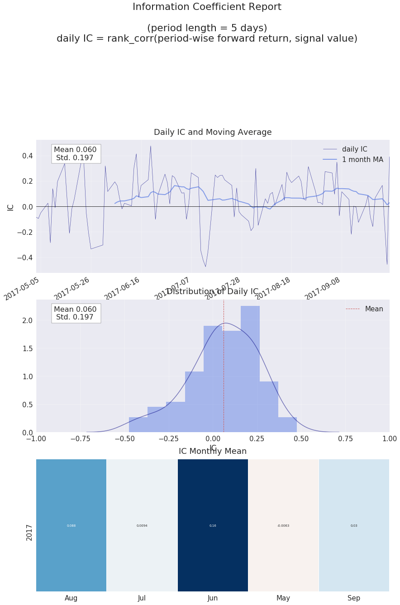
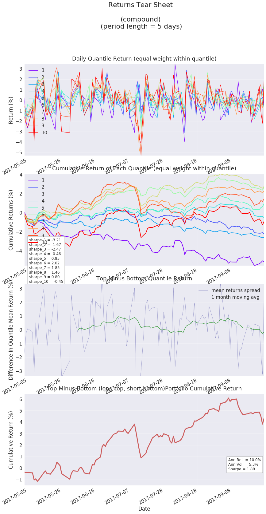

# TimingDigger

## 介绍
TimingDigger可以在设计完选股因子和事件之后，加入简单的择时出场条件对因子进行进一步测试。支持设置止盈、止损等出场方式。

*** 步骤 ***
1. 实例化TimingDigger-指定因子绩效表现的输出路径和输出格式
2. 因子数据预处理-添加择时信号
3. 报告输出

# step 1 实例化SignalDigger-指定因子绩效表现的输出路径和输出格式


```python
import warnings
warnings.filterwarnings('ignore')
```


```python
from jaqs_fxdayu.research import TimingDigger

# step 1：实例化TimingDigger 通过output_folder和output_format指定测试报告的输出路径和输出格式，通过signal_name指定绩效文件名称
td = TimingDigger(output_folder=".", output_format='pdf', signal_name="signal")
```

# step 2 数据预处理

## process_signal

- ` jaqs_fxdayu.research.timingdigger.digger.TimingDigger.process_signal(*args, **kwargs) `

**简要描述：**

- 将因子数据处理成signal_data--包含了因子信号及相关收益、出场时间、quantile分组等评价维度的综合数据(pandas.MultiIndex)

**参数：**


|参数名|必选|类型|说明|
|:----    |:---|:----- |-----   |
|enter_signal|是  |pandas.DataFrame|进场事件信号/因子值,日期为索引，股票品种为columns。如为进场事件信号，要求信号值**只能**为-2（开空）,0（不操作）,2（开多）|
|exit_signal|否  |pandas.DataFrame/list of pandas.DataFrame|单个或多个出场信号,日期为索引，股票品种为columns。信号值**只能**为-1（平空）,0（不操作）,1（平多）。多个出场信号在测试过程中会选择最先触发的信号执行。|
|sig_type|否  |str（long/short）| 待测试进场事件信号或因子类型，为long则处理多头信号，为short则处理空头信号。默认为"long" |
|price |是，price与daily_ret二选一  |pandas.DataFrame|涉及到的股票的价格数据，用于作为进出场价用于计算收益,日期为索引，股票品种为columns|
|daily_ret |是，price与daily_ret二选一  |pandas.DataFrame| 涉及到的股票的每日收益，日期为索引，股票品种为columns|
|max_holding_period |否  |int|进场最大持有期数，达到该期数必然出场。在进场信号是因子值时必须指定；事件信号如有其它出场条件可不指定|
|stoploss |否  |float| 止损出场条件。一个**负**的浮点数，如-0.01，表示进场亏损1%后止损出场。默认为空|
|stopprofit |否  |float| 止盈出场条件。一个**正**的浮点数，如0.01，表示进场获利1%后止盈出场。默认为空|
|mask |否  |pandas.DataFrame|一张由bool值组成的表格,日期为索引，股票品种为columns，表示在做分析时是否要对某期的某个品种过滤。对应位置为True则**过滤**（剔除）——不纳入分析考虑。默认为空，不执行过滤操作|
|can_enter |否  |pandas.DataFrame|一张由bool值组成的表格,日期为索引，股票品种为columns，表示某期的某个品种是否可以进场。对应位置为True则可以进场。默认为空，任何时间任何品种均可进场|
|can_exit |否  |pandas.DataFrame|一张由bool值组成的表格,日期为索引，股票品种为columns，表示某期的某个品种是否可以出场。对应位置为True则可以出场。默认为空，任何时间任何品种均可出场|
|group |否  |pandas.DataFrame|因子涉及到的股票的分组(行业分类),日期为索引，股票品种为columns,默认为空|
|n_quantiles |否  |int|根据每日信号的大小分成n_quantiles组。当测试进场事件信号时需指定为1。默认为1|
|commission |否 |float|手续费比例,每笔交易收取的手续费百分比,默认为万分之八0.0008|


**示例(以多头信号分析为例)：**

** case 1 ：事件类进场信号 + 出场信号测试 **


```python
import numpy as np
from jaqs_fxdayu.data import DataView

# 加载dataview数据集
dv = DataView()
dataview_folder = './data'
dv.load_dataview(dataview_folder)
```

    Dataview loaded successfully.


```python
# 定义进场信号

dv.add_formula("MA3","Ts_Mean(close_adj,3)",is_quarterly=False,add_data=True)
dv.add_formula("MA5","Ts_Mean(close_adj,5)",is_quarterly=False,add_data=True)
# 进场信号 3日均线上穿5日均线
dv.add_formula("long","If((MA3>=MA5)&&(Delay(MA3<MA5, 1)),2,0)",is_quarterly=False, add_data=True).head()
```


<div>
<style>
    .dataframe thead tr:only-child th {
        text-align: right;
    }

    .dataframe thead th {
        text-align: left;
    }

    .dataframe tbody tr th {
        vertical-align: top;
    }
</style>
<table border="1" class="dataframe">
  <thead>
    <tr style="text-align: right;">
      <th>symbol</th>
      <th>000001.SZ</th>
      <th>000002.SZ</th>
      <th>000008.SZ</th>
      <th>000009.SZ</th>
      <th>000027.SZ</th>
      <th>000039.SZ</th>
      <th>000060.SZ</th>
      <th>000061.SZ</th>
      <th>000063.SZ</th>
      <th>000069.SZ</th>
      <th>...</th>
      <th>601988.SH</th>
      <th>601989.SH</th>
      <th>601992.SH</th>
      <th>601997.SH</th>
      <th>601998.SH</th>
      <th>603000.SH</th>
      <th>603160.SH</th>
      <th>603858.SH</th>
      <th>603885.SH</th>
      <th>603993.SH</th>
    </tr>
    <tr>
      <th>trade_date</th>
      <th></th>
      <th></th>
      <th></th>
      <th></th>
      <th></th>
      <th></th>
      <th></th>
      <th></th>
      <th></th>
      <th></th>
      <th></th>
      <th></th>
      <th></th>
      <th></th>
      <th></th>
      <th></th>
      <th></th>
      <th></th>
      <th></th>
      <th></th>
      <th></th>
    </tr>
  </thead>
  <tbody>
    <tr>
      <th>20170502</th>
      <td>0.0</td>
      <td>0.0</td>
      <td>0.0</td>
      <td>0.0</td>
      <td>0.0</td>
      <td>0.0</td>
      <td>0.0</td>
      <td>0.0</td>
      <td>0.0</td>
      <td>0.0</td>
      <td>...</td>
      <td>0.0</td>
      <td>0.0</td>
      <td>0.0</td>
      <td>0.0</td>
      <td>0.0</td>
      <td>0.0</td>
      <td>0.0</td>
      <td>0.0</td>
      <td>0.0</td>
      <td>0.0</td>
    </tr>
    <tr>
      <th>20170503</th>
      <td>0.0</td>
      <td>0.0</td>
      <td>0.0</td>
      <td>2.0</td>
      <td>0.0</td>
      <td>2.0</td>
      <td>0.0</td>
      <td>0.0</td>
      <td>0.0</td>
      <td>0.0</td>
      <td>...</td>
      <td>0.0</td>
      <td>0.0</td>
      <td>0.0</td>
      <td>0.0</td>
      <td>0.0</td>
      <td>2.0</td>
      <td>0.0</td>
      <td>0.0</td>
      <td>2.0</td>
      <td>0.0</td>
    </tr>
    <tr>
      <th>20170504</th>
      <td>0.0</td>
      <td>0.0</td>
      <td>0.0</td>
      <td>0.0</td>
      <td>0.0</td>
      <td>0.0</td>
      <td>0.0</td>
      <td>0.0</td>
      <td>0.0</td>
      <td>0.0</td>
      <td>...</td>
      <td>0.0</td>
      <td>0.0</td>
      <td>0.0</td>
      <td>0.0</td>
      <td>0.0</td>
      <td>0.0</td>
      <td>0.0</td>
      <td>0.0</td>
      <td>0.0</td>
      <td>0.0</td>
    </tr>
    <tr>
      <th>20170505</th>
      <td>0.0</td>
      <td>0.0</td>
      <td>0.0</td>
      <td>0.0</td>
      <td>0.0</td>
      <td>0.0</td>
      <td>0.0</td>
      <td>0.0</td>
      <td>2.0</td>
      <td>0.0</td>
      <td>...</td>
      <td>0.0</td>
      <td>0.0</td>
      <td>0.0</td>
      <td>0.0</td>
      <td>0.0</td>
      <td>0.0</td>
      <td>0.0</td>
      <td>0.0</td>
      <td>2.0</td>
      <td>0.0</td>
    </tr>
    <tr>
      <th>20170508</th>
      <td>0.0</td>
      <td>0.0</td>
      <td>0.0</td>
      <td>0.0</td>
      <td>0.0</td>
      <td>0.0</td>
      <td>0.0</td>
      <td>0.0</td>
      <td>0.0</td>
      <td>0.0</td>
      <td>...</td>
      <td>2.0</td>
      <td>0.0</td>
      <td>0.0</td>
      <td>0.0</td>
      <td>0.0</td>
      <td>0.0</td>
      <td>0.0</td>
      <td>0.0</td>
      <td>0.0</td>
      <td>0.0</td>
    </tr>
  </tbody>
</table>
<p>5 rows × 330 columns</p>
</div>


```python
# 定义出场信号 1 3日均线下穿5日均线
dv.add_formula("exit_long1","If((MA3<=MA5)&&(Delay(MA3>MA5, 1)),1,0)",is_quarterly=False, add_data=True).head()
```


<div>
<style>
    .dataframe thead tr:only-child th {
        text-align: right;
    }

    .dataframe thead th {
        text-align: left;
    }

    .dataframe tbody tr th {
        vertical-align: top;
    }
</style>
<table border="1" class="dataframe">
  <thead>
    <tr style="text-align: right;">
      <th>symbol</th>
      <th>000001.SZ</th>
      <th>000002.SZ</th>
      <th>000008.SZ</th>
      <th>000009.SZ</th>
      <th>000027.SZ</th>
      <th>000039.SZ</th>
      <th>000060.SZ</th>
      <th>000061.SZ</th>
      <th>000063.SZ</th>
      <th>000069.SZ</th>
      <th>...</th>
      <th>601988.SH</th>
      <th>601989.SH</th>
      <th>601992.SH</th>
      <th>601997.SH</th>
      <th>601998.SH</th>
      <th>603000.SH</th>
      <th>603160.SH</th>
      <th>603858.SH</th>
      <th>603885.SH</th>
      <th>603993.SH</th>
    </tr>
    <tr>
      <th>trade_date</th>
      <th></th>
      <th></th>
      <th></th>
      <th></th>
      <th></th>
      <th></th>
      <th></th>
      <th></th>
      <th></th>
      <th></th>
      <th></th>
      <th></th>
      <th></th>
      <th></th>
      <th></th>
      <th></th>
      <th></th>
      <th></th>
      <th></th>
      <th></th>
      <th></th>
    </tr>
  </thead>
  <tbody>
    <tr>
      <th>20170502</th>
      <td>1.0</td>
      <td>0.0</td>
      <td>0.0</td>
      <td>0.0</td>
      <td>0.0</td>
      <td>0.0</td>
      <td>0.0</td>
      <td>0.0</td>
      <td>1.0</td>
      <td>1.0</td>
      <td>...</td>
      <td>0.0</td>
      <td>0.0</td>
      <td>0.0</td>
      <td>1.0</td>
      <td>0.0</td>
      <td>0.0</td>
      <td>0.0</td>
      <td>0.0</td>
      <td>0.0</td>
      <td>0.0</td>
    </tr>
    <tr>
      <th>20170503</th>
      <td>0.0</td>
      <td>0.0</td>
      <td>0.0</td>
      <td>0.0</td>
      <td>1.0</td>
      <td>0.0</td>
      <td>0.0</td>
      <td>0.0</td>
      <td>0.0</td>
      <td>0.0</td>
      <td>...</td>
      <td>1.0</td>
      <td>0.0</td>
      <td>0.0</td>
      <td>0.0</td>
      <td>0.0</td>
      <td>0.0</td>
      <td>0.0</td>
      <td>0.0</td>
      <td>0.0</td>
      <td>0.0</td>
    </tr>
    <tr>
      <th>20170504</th>
      <td>0.0</td>
      <td>0.0</td>
      <td>0.0</td>
      <td>0.0</td>
      <td>0.0</td>
      <td>1.0</td>
      <td>1.0</td>
      <td>0.0</td>
      <td>0.0</td>
      <td>0.0</td>
      <td>...</td>
      <td>0.0</td>
      <td>0.0</td>
      <td>0.0</td>
      <td>0.0</td>
      <td>0.0</td>
      <td>1.0</td>
      <td>0.0</td>
      <td>0.0</td>
      <td>1.0</td>
      <td>0.0</td>
    </tr>
    <tr>
      <th>20170505</th>
      <td>0.0</td>
      <td>0.0</td>
      <td>0.0</td>
      <td>1.0</td>
      <td>0.0</td>
      <td>0.0</td>
      <td>0.0</td>
      <td>0.0</td>
      <td>0.0</td>
      <td>0.0</td>
      <td>...</td>
      <td>0.0</td>
      <td>0.0</td>
      <td>1.0</td>
      <td>0.0</td>
      <td>0.0</td>
      <td>0.0</td>
      <td>1.0</td>
      <td>0.0</td>
      <td>0.0</td>
      <td>1.0</td>
    </tr>
    <tr>
      <th>20170508</th>
      <td>0.0</td>
      <td>0.0</td>
      <td>0.0</td>
      <td>0.0</td>
      <td>0.0</td>
      <td>0.0</td>
      <td>0.0</td>
      <td>0.0</td>
      <td>1.0</td>
      <td>0.0</td>
      <td>...</td>
      <td>0.0</td>
      <td>0.0</td>
      <td>0.0</td>
      <td>0.0</td>
      <td>0.0</td>
      <td>0.0</td>
      <td>0.0</td>
      <td>0.0</td>
      <td>1.0</td>
      <td>0.0</td>
    </tr>
  </tbody>
</table>
<p>5 rows × 330 columns</p>
</div>


```python
# 定义出场信号 2 收盘价下穿5日均线
dv.add_formula("exit_long2","If((close_adj<=MA5)&&(Delay(close_adj>MA5, 1)),1,0)",is_quarterly=False, add_data=True).head()
```


<div>
<style>
    .dataframe thead tr:only-child th {
        text-align: right;
    }

    .dataframe thead th {
        text-align: left;
    }

    .dataframe tbody tr th {
        vertical-align: top;
    }
</style>
<table border="1" class="dataframe">
  <thead>
    <tr style="text-align: right;">
      <th>symbol</th>
      <th>000001.SZ</th>
      <th>000002.SZ</th>
      <th>000008.SZ</th>
      <th>000009.SZ</th>
      <th>000027.SZ</th>
      <th>000039.SZ</th>
      <th>000060.SZ</th>
      <th>000061.SZ</th>
      <th>000063.SZ</th>
      <th>000069.SZ</th>
      <th>...</th>
      <th>601988.SH</th>
      <th>601989.SH</th>
      <th>601992.SH</th>
      <th>601997.SH</th>
      <th>601998.SH</th>
      <th>603000.SH</th>
      <th>603160.SH</th>
      <th>603858.SH</th>
      <th>603885.SH</th>
      <th>603993.SH</th>
    </tr>
    <tr>
      <th>trade_date</th>
      <th></th>
      <th></th>
      <th></th>
      <th></th>
      <th></th>
      <th></th>
      <th></th>
      <th></th>
      <th></th>
      <th></th>
      <th></th>
      <th></th>
      <th></th>
      <th></th>
      <th></th>
      <th></th>
      <th></th>
      <th></th>
      <th></th>
      <th></th>
      <th></th>
    </tr>
  </thead>
  <tbody>
    <tr>
      <th>20170502</th>
      <td>1.0</td>
      <td>0.0</td>
      <td>0.0</td>
      <td>0.0</td>
      <td>1.0</td>
      <td>1.0</td>
      <td>0.0</td>
      <td>0.0</td>
      <td>1.0</td>
      <td>0.0</td>
      <td>...</td>
      <td>1.0</td>
      <td>0.0</td>
      <td>0.0</td>
      <td>0.0</td>
      <td>0.0</td>
      <td>0.0</td>
      <td>0.0</td>
      <td>0.0</td>
      <td>0.0</td>
      <td>0.0</td>
    </tr>
    <tr>
      <th>20170503</th>
      <td>0.0</td>
      <td>0.0</td>
      <td>0.0</td>
      <td>0.0</td>
      <td>0.0</td>
      <td>0.0</td>
      <td>1.0</td>
      <td>0.0</td>
      <td>0.0</td>
      <td>0.0</td>
      <td>...</td>
      <td>0.0</td>
      <td>0.0</td>
      <td>1.0</td>
      <td>0.0</td>
      <td>0.0</td>
      <td>0.0</td>
      <td>0.0</td>
      <td>0.0</td>
      <td>0.0</td>
      <td>0.0</td>
    </tr>
    <tr>
      <th>20170504</th>
      <td>0.0</td>
      <td>0.0</td>
      <td>0.0</td>
      <td>0.0</td>
      <td>0.0</td>
      <td>0.0</td>
      <td>0.0</td>
      <td>0.0</td>
      <td>0.0</td>
      <td>0.0</td>
      <td>...</td>
      <td>0.0</td>
      <td>0.0</td>
      <td>0.0</td>
      <td>0.0</td>
      <td>0.0</td>
      <td>1.0</td>
      <td>0.0</td>
      <td>1.0</td>
      <td>1.0</td>
      <td>1.0</td>
    </tr>
    <tr>
      <th>20170505</th>
      <td>0.0</td>
      <td>0.0</td>
      <td>0.0</td>
      <td>1.0</td>
      <td>0.0</td>
      <td>0.0</td>
      <td>0.0</td>
      <td>0.0</td>
      <td>1.0</td>
      <td>0.0</td>
      <td>...</td>
      <td>0.0</td>
      <td>0.0</td>
      <td>1.0</td>
      <td>0.0</td>
      <td>0.0</td>
      <td>0.0</td>
      <td>1.0</td>
      <td>0.0</td>
      <td>0.0</td>
      <td>0.0</td>
    </tr>
    <tr>
      <th>20170508</th>
      <td>0.0</td>
      <td>0.0</td>
      <td>0.0</td>
      <td>0.0</td>
      <td>0.0</td>
      <td>0.0</td>
      <td>0.0</td>
      <td>0.0</td>
      <td>0.0</td>
      <td>0.0</td>
      <td>...</td>
      <td>0.0</td>
      <td>0.0</td>
      <td>0.0</td>
      <td>0.0</td>
      <td>0.0</td>
      <td>0.0</td>
      <td>0.0</td>
      <td>0.0</td>
      <td>1.0</td>
      <td>0.0</td>
    </tr>
  </tbody>
</table>
<p>5 rows × 330 columns</p>
</div>


```python
# 定义过滤条件

import numpy as np

# 定义信号过滤条件-非指数成分
df_index_member = dv.get_ts('index_member')
mask = dv.get_ts('index_member') == 0  # 定义信号过滤条件-非指数成分

# 定义可买入卖出条件——未停牌、未涨跌停
can_trade =dv.get_ts('trade_status')==1 # 可以交易
# 涨停
up_limit = dv.add_formula('up_limit', '(open - Delay(close, 1)) / Delay(close, 1) > 0.095', is_quarterly=False)
# 跌停
down_limit = dv.add_formula('down_limit', '(open - Delay(close, 1)) / Delay(close, 1) < -0.095', is_quarterly=False)
can_enter = np.logical_and(up_limit < 1, can_trade)  # 未涨停未停牌
can_exit = np.logical_and(down_limit < 1, can_trade)  # 未跌停未停牌
```


```python
td.process_signal(
    enter_signal=dv.get_ts("long"),
    exit_signal=[dv.get_ts("exit_long1"), dv.get_ts("exit_long2")],
    sig_type="long",  # 信号类型 long/short
    price=dv.get_ts("close_adj"),
    max_holding_period=5,  # 最大持有天数 可为空
    stoploss=-0.01,  # 止损百分比 负数 可为空
    stopprofit=0.02,  # 止盈百分比 正数 可为空
    mask=mask,
    can_enter=can_enter,
    can_exit=can_exit,
    group=None,
    n_quantiles=1, # 事件分析时，必须设置为1
    commission=0.0008
)
```

    Nan Data Count (should be zero) : 0;  Percentage of effective data: 8%


# step 3 测试报告输出

## signal_data

- ` jaqs_fxdayu.research.timingdigger.digger.TimingDigger.signal_data `

**简要描述：**

- process_signal方法处理后的signal_data--包含了因子信号及相关收益、出场时间、quantile分组等评价维度的综合数据(pandas.MultiIndex)
- 需要执行process_signal后该属性才有值

**返回：**

字典，keys为long,short,分别存有long、short的signal_data。

signal_data格式为：

trade_date+symbol为MultiIndex,columns为signal(因子)、return(收益)、exit_time(出场时间)、group(分组/行业分类)、quantile(按因子值分组)

**示例：**


```python
print(td.signal_data.keys())
td.signal_data["long"].head()
```

    dict_keys(['long'])


<div>
<style>
    .dataframe thead tr:only-child th {
        text-align: right;
    }

    .dataframe thead th {
        text-align: left;
    }

    .dataframe tbody tr th {
        vertical-align: top;
    }
</style>
<table border="1" class="dataframe">
  <thead>
    <tr style="text-align: right;">
      <th></th>
      <th></th>
      <th>signal</th>
      <th>return</th>
      <th>exit_time</th>
      <th>quantile</th>
    </tr>
    <tr>
      <th>trade_date</th>
      <th>symbol</th>
      <th></th>
      <th></th>
      <th></th>
      <th></th>
    </tr>
  </thead>
  <tbody>
    <tr>
      <th rowspan="5" valign="top">20170503</th>
      <th>002153.SZ</th>
      <td>2.0</td>
      <td>-0.004048</td>
      <td>20170509.0</td>
      <td>1</td>
    </tr>
    <tr>
      <th>002739.SZ</th>
      <td>2.0</td>
      <td>-0.011892</td>
      <td>20170504.0</td>
      <td>1</td>
    </tr>
    <tr>
      <th>300072.SZ</th>
      <td>2.0</td>
      <td>-0.037187</td>
      <td>20170508.0</td>
      <td>1</td>
    </tr>
    <tr>
      <th>600009.SH</th>
      <td>2.0</td>
      <td>0.025240</td>
      <td>20170504.0</td>
      <td>1</td>
    </tr>
    <tr>
      <th>600016.SH</th>
      <td>2.0</td>
      <td>-0.009797</td>
      <td>20170504.0</td>
      <td>1</td>
    </tr>
  </tbody>
</table>
</div>


## create_event_report

- ` jaqs_fxdayu.research.timingdigger.digger.TimingDigger.create_event_report(sig_type="long",by_symbol=False) `

**简要描述：**

- 事件分析
- 需要执行process_signal后才能执行该方法
- 注意：在process_signal里需要传入**事件类型**的enter_signal，并指定**n_quantiles=1**


**参数：**


|参数名|必选|类型|说明|
|:----    |:---|:----- |-----   |
|sig_type|否  |str（long/short/long_short）| 对何种信号进行事件分析。long:多头信号；short：空头信号；long_short:多空组合信号。默认为"long" |
|by_symbol |否 |bool| 是否对逐个品种进行分析|

**返回：**

输出事件分析报告；

事件分析报告的总体概述保存在TimingDigger.event_perf属性中

若by_symbol=True。则还会对逐个品种进行绩效分析，并将相应分析报告保存在TimingDigger.symbol_event_perf属性中,并将每个品种的进出场位置和进出场收益绘图保存

**示例：**


```python
td.create_event_report(sig_type="long",
                       by_symbol=True)
```

    *****-Summary-*****
    Event Analysis
                             win      loss       all
    t-stat                44.271   -58.072     2.289
    p-value                0.000     0.000     0.022
    mean                   0.023    -0.016     0.001
    std                    0.019     0.012     0.025
    info_ratio             1.224    -1.418     0.042
    skewness               1.359    -2.071     0.710
    kurtosis               2.441     9.370     1.400
    pct5                   0.001    -0.036    -0.031
    pct25                  0.008    -0.021    -0.016
    pct50                  0.021    -0.014    -0.004
    pct75                  0.032    -0.010     0.019
    pct95                  0.061    -0.002     0.044
    occurance           1310.000  1679.000  2989.000
    win_ratio                NaN       NaN     0.438
    win_mean/loss_mean       NaN       NaN     1.427


```python
td.event_perf["long"]
```


<div>
<style>
    .dataframe thead tr:only-child th {
        text-align: right;
    }

    .dataframe thead th {
        text-align: left;
    }

    .dataframe tbody tr th {
        vertical-align: top;
    }
</style>
<table border="1" class="dataframe">
  <thead>
    <tr style="text-align: right;">
      <th></th>
      <th>t-stat</th>
      <th>p-value</th>
      <th>mean</th>
      <th>std</th>
      <th>info_ratio</th>
      <th>skewness</th>
      <th>kurtosis</th>
      <th>pct5</th>
      <th>pct25</th>
      <th>pct50</th>
      <th>pct75</th>
      <th>pct95</th>
      <th>occurance</th>
      <th>win_ratio</th>
      <th>win_mean/loss_mean</th>
    </tr>
  </thead>
  <tbody>
    <tr>
      <th>win</th>
      <td>44.271492</td>
      <td>0.00000</td>
      <td>0.023433</td>
      <td>0.01915</td>
      <td>1.223642</td>
      <td>1.359191</td>
      <td>2.440891</td>
      <td>0.001216</td>
      <td>0.008171</td>
      <td>0.021476</td>
      <td>0.032069</td>
      <td>0.060853</td>
      <td>1310</td>
      <td>NaN</td>
      <td>NaN</td>
    </tr>
    <tr>
      <th>loss</th>
      <td>-58.071991</td>
      <td>0.00000</td>
      <td>-0.016416</td>
      <td>0.01158</td>
      <td>-1.417656</td>
      <td>-2.070985</td>
      <td>9.369845</td>
      <td>-0.036422</td>
      <td>-0.020808</td>
      <td>-0.014483</td>
      <td>-0.009689</td>
      <td>-0.001836</td>
      <td>1679</td>
      <td>NaN</td>
      <td>NaN</td>
    </tr>
    <tr>
      <th>all</th>
      <td>2.288720</td>
      <td>0.02217</td>
      <td>0.001048</td>
      <td>0.02504</td>
      <td>0.041870</td>
      <td>0.709998</td>
      <td>1.400120</td>
      <td>-0.030652</td>
      <td>-0.015525</td>
      <td>-0.003945</td>
      <td>0.019289</td>
      <td>0.043955</td>
      <td>2989</td>
      <td>0.438274</td>
      <td>1.427396</td>
    </tr>
  </tbody>
</table>
</div>


```python
td.symbol_event_perf["long"].head()
```


<div>
<style>
    .dataframe thead tr:only-child th {
        text-align: right;
    }

    .dataframe thead th {
        text-align: left;
    }

    .dataframe tbody tr th {
        vertical-align: top;
    }
</style>
<table border="1" class="dataframe">
  <thead>
    <tr style="text-align: right;">
      <th></th>
      <th></th>
      <th>t-stat</th>
      <th>p-value</th>
      <th>mean</th>
      <th>std</th>
      <th>info_ratio</th>
      <th>skewness</th>
      <th>kurtosis</th>
      <th>pct5</th>
      <th>pct25</th>
      <th>pct50</th>
      <th>pct75</th>
      <th>pct95</th>
      <th>occurance</th>
      <th>win_ratio</th>
      <th>win_mean/loss_mean</th>
    </tr>
    <tr>
      <th>symbol</th>
      <th></th>
      <th></th>
      <th></th>
      <th></th>
      <th></th>
      <th></th>
      <th></th>
      <th></th>
      <th></th>
      <th></th>
      <th></th>
      <th></th>
      <th></th>
      <th></th>
      <th></th>
      <th></th>
    </tr>
  </thead>
  <tbody>
    <tr>
      <th rowspan="3" valign="top">000001.SZ</th>
      <th>win</th>
      <td>1.910123</td>
      <td>0.15211</td>
      <td>0.027446</td>
      <td>0.024888</td>
      <td>1.102810</td>
      <td>0.747736</td>
      <td>-0.876364</td>
      <td>0.003150</td>
      <td>0.014561</td>
      <td>0.020733</td>
      <td>0.033619</td>
      <td>0.061141</td>
      <td>4.0</td>
      <td>NaN</td>
      <td>NaN</td>
    </tr>
    <tr>
      <th>loss</th>
      <td>-7.720492</td>
      <td>0.00058</td>
      <td>-0.014826</td>
      <td>0.004294</td>
      <td>-3.452709</td>
      <td>-0.616354</td>
      <td>0.003973</td>
      <td>-0.021118</td>
      <td>-0.015247</td>
      <td>-0.014339</td>
      <td>-0.013495</td>
      <td>-0.009708</td>
      <td>6.0</td>
      <td>NaN</td>
      <td>NaN</td>
    </tr>
    <tr>
      <th>all</th>
      <td>0.238289</td>
      <td>0.81699</td>
      <td>0.002083</td>
      <td>0.026224</td>
      <td>0.079430</td>
      <td>1.469346</td>
      <td>1.199710</td>
      <td>-0.019595</td>
      <td>-0.014553</td>
      <td>-0.010924</td>
      <td>0.014561</td>
      <td>0.047380</td>
      <td>10.0</td>
      <td>0.4</td>
      <td>1.851233</td>
    </tr>
    <tr>
      <th rowspan="2" valign="top">000002.SZ</th>
      <th>win</th>
      <td>3.606425</td>
      <td>0.03660</td>
      <td>0.058350</td>
      <td>0.028024</td>
      <td>2.082170</td>
      <td>0.321735</td>
      <td>-1.339903</td>
      <td>0.027695</td>
      <td>0.037342</td>
      <td>0.054413</td>
      <td>0.075421</td>
      <td>0.094517</td>
      <td>4.0</td>
      <td>NaN</td>
      <td>NaN</td>
    </tr>
    <tr>
      <th>loss</th>
      <td>-6.458885</td>
      <td>0.00132</td>
      <td>-0.026623</td>
      <td>0.009217</td>
      <td>-2.888501</td>
      <td>-0.631208</td>
      <td>-0.403030</td>
      <td>-0.040439</td>
      <td>-0.029601</td>
      <td>-0.025327</td>
      <td>-0.021370</td>
      <td>-0.015835</td>
      <td>6.0</td>
      <td>NaN</td>
      <td>NaN</td>
    </tr>
  </tbody>
</table>
</div>


## create_information_report

** **

- ` jaqs_fxdayu.research.timingdigger.digger.TimingDigger.create_information_report(sig_type="long") `

**简要描述：**

- ic分析
- 需要执行process_signal后才能执行该方法
- 注意：在process_signal里需要传入**因子类型**（非-2,2等离散事件）的enter_signal，并指定**n_quantiles**为大于1的正整数

**参数：**

|参数名|必选|类型|说明|
|:----    |:---|:----- |-----   |
|sig_type|否  |str（long/short）| 对何种信号进行ic分析。long:多头信号；short：空头信号。默认为"long" |


**返回：**

ic分析结果，并将结果保存至预设目录

**示例：**


```python
# 定义因子 动量反转
dv.add_formula("momentum","-1*Return(close_adj,5)",is_quarterly=False, add_data=True).head()
```


<div>
<style>
    .dataframe thead tr:only-child th {
        text-align: right;
    }

    .dataframe thead th {
        text-align: left;
    }

    .dataframe tbody tr th {
        vertical-align: top;
    }
</style>
<table border="1" class="dataframe">
  <thead>
    <tr style="text-align: right;">
      <th>symbol</th>
      <th>000001.SZ</th>
      <th>000002.SZ</th>
      <th>000008.SZ</th>
      <th>000009.SZ</th>
      <th>000027.SZ</th>
      <th>000039.SZ</th>
      <th>000060.SZ</th>
      <th>000061.SZ</th>
      <th>000063.SZ</th>
      <th>000069.SZ</th>
      <th>...</th>
      <th>601988.SH</th>
      <th>601989.SH</th>
      <th>601992.SH</th>
      <th>601997.SH</th>
      <th>601998.SH</th>
      <th>603000.SH</th>
      <th>603160.SH</th>
      <th>603858.SH</th>
      <th>603885.SH</th>
      <th>603993.SH</th>
    </tr>
    <tr>
      <th>trade_date</th>
      <th></th>
      <th></th>
      <th></th>
      <th></th>
      <th></th>
      <th></th>
      <th></th>
      <th></th>
      <th></th>
      <th></th>
      <th></th>
      <th></th>
      <th></th>
      <th></th>
      <th></th>
      <th></th>
      <th></th>
      <th></th>
      <th></th>
      <th></th>
      <th></th>
    </tr>
  </thead>
  <tbody>
    <tr>
      <th>20170502</th>
      <td>-0.001120</td>
      <td>0.060206</td>
      <td>0.076389</td>
      <td>-0.004657</td>
      <td>-0.000000</td>
      <td>0.008653</td>
      <td>-0.021934</td>
      <td>0.064257</td>
      <td>-0.022609</td>
      <td>-0.007463</td>
      <td>...</td>
      <td>0.002801</td>
      <td>0.035912</td>
      <td>-0.178571</td>
      <td>0.000638</td>
      <td>0.032415</td>
      <td>0.018679</td>
      <td>-0.164961</td>
      <td>0.007154</td>
      <td>0.006682</td>
      <td>-0.073634</td>
    </tr>
    <tr>
      <th>20170503</th>
      <td>0.010000</td>
      <td>0.082238</td>
      <td>0.081206</td>
      <td>0.005807</td>
      <td>0.015782</td>
      <td>0.014171</td>
      <td>-0.011976</td>
      <td>0.064909</td>
      <td>-0.009060</td>
      <td>0.030377</td>
      <td>...</td>
      <td>0.011204</td>
      <td>0.093668</td>
      <td>-0.048209</td>
      <td>0.016281</td>
      <td>0.045234</td>
      <td>0.005348</td>
      <td>-0.122644</td>
      <td>0.009349</td>
      <td>0.007989</td>
      <td>-0.064984</td>
    </tr>
    <tr>
      <th>20170504</th>
      <td>0.027809</td>
      <td>0.065815</td>
      <td>0.065243</td>
      <td>0.009281</td>
      <td>0.014347</td>
      <td>0.014393</td>
      <td>0.023553</td>
      <td>0.058763</td>
      <td>0.005022</td>
      <td>0.040767</td>
      <td>...</td>
      <td>0.013966</td>
      <td>0.064917</td>
      <td>0.008761</td>
      <td>0.018856</td>
      <td>0.024917</td>
      <td>0.017663</td>
      <td>-0.076829</td>
      <td>0.012894</td>
      <td>0.003136</td>
      <td>-0.029045</td>
    </tr>
    <tr>
      <th>20170505</th>
      <td>0.037904</td>
      <td>0.044028</td>
      <td>0.082725</td>
      <td>0.016667</td>
      <td>0.027182</td>
      <td>0.044025</td>
      <td>0.036098</td>
      <td>0.041139</td>
      <td>0.015109</td>
      <td>0.022333</td>
      <td>...</td>
      <td>0.013928</td>
      <td>0.056899</td>
      <td>-0.007782</td>
      <td>0.048811</td>
      <td>0.026667</td>
      <td>0.050471</td>
      <td>-0.036395</td>
      <td>0.022657</td>
      <td>-0.008513</td>
      <td>0.017507</td>
    </tr>
    <tr>
      <th>20170508</th>
      <td>0.046719</td>
      <td>0.052821</td>
      <td>0.095297</td>
      <td>0.039333</td>
      <td>0.047210</td>
      <td>0.070501</td>
      <td>0.035019</td>
      <td>0.020364</td>
      <td>0.041104</td>
      <td>0.039264</td>
      <td>...</td>
      <td>0.005571</td>
      <td>0.088068</td>
      <td>0.129950</td>
      <td>0.056015</td>
      <td>0.024917</td>
      <td>0.053163</td>
      <td>-0.015175</td>
      <td>0.045007</td>
      <td>0.010733</td>
      <td>0.017392</td>
    </tr>
  </tbody>
</table>
<p>5 rows × 330 columns</p>
</div>


```python
td.process_signal(
    enter_signal=dv.get_ts("momentum"),# 必须传入因子类型的enter_signal
    exit_signal=[dv.get_ts("exit_long1"), dv.get_ts("exit_long2")],
    sig_type="long",  # 信号类型 long/short
    price=dv.get_ts("close_adj"),
    max_holding_period=5,  # 最大持有天数 可为空
    stoploss=-0.01,  # 止损百分比 负数 可为空
    stopprofit=0.02,  # 止盈百分比 正数 可为空
    mask=mask,
    can_enter=can_enter,
    can_exit=can_exit,
    group=None,
    n_quantiles=10, # 必须设置为大于1的正整数
    commission=0.0008
)
```

    Nan Data Count (should be zero) : 0;  Percentage of effective data: 64%


```python
%matplotlib inline
td.create_information_report(sig_type="long")
```

    Information Analysis
                    ic
    IC Mean      0.060
    IC Std.      0.197
    t-stat(IC)   3.118
    p-value(IC)  0.002
    IC Skew     -0.535
    IC Kurtosis  0.088
    Ann. IR      0.304
    Figure saved: /home/xinger/Desktop/jaqs_plus/jaqs-fxdayu/docs/_source/signal#sig_type:long_information_report.pdf


    <Figure size 432x288 with 0 Axes>





## ic_report_data

- `jaqs_fxdayu.research.timingdigger.digger.TimingDigger.ic_report_data `

**简要描述：**

- ic分析相关数据
- 需要执行create_information_report后该属性才有值

**返回：**

dict of dict

由"long","short"所组成的字典（dict），每个字典里有'daily_ic'，'monthly_ic'所组成的字典(dict)

**示例：**


```python
print(td.ic_report_data.keys())
print(td.ic_report_data["long"].keys())
td.ic_report_data["long"]["daily_ic"].head()
```

    dict_keys(['long'])
    dict_keys(['daily_ic', 'monthly_ic'])


<div>
<style>
    .dataframe thead tr:only-child th {
        text-align: right;
    }

    .dataframe thead th {
        text-align: left;
    }

    .dataframe tbody tr th {
        vertical-align: top;
    }
</style>
<table border="1" class="dataframe">
  <thead>
    <tr style="text-align: right;">
      <th></th>
      <th>ic</th>
    </tr>
    <tr>
      <th>trade_date</th>
      <th></th>
    </tr>
  </thead>
  <tbody>
    <tr>
      <th>2017-05-03</th>
      <td>-0.084169</td>
    </tr>
    <tr>
      <th>2017-05-04</th>
      <td>-0.095228</td>
    </tr>
    <tr>
      <th>2017-05-05</th>
      <td>-0.049956</td>
    </tr>
    <tr>
      <th>2017-05-08</th>
      <td>0.025346</td>
    </tr>
    <tr>
      <th>2017-05-09</th>
      <td>-0.285701</td>
    </tr>
  </tbody>
</table>
</div>


## create_returns_report

- ` jaqs_fxdayu.research.timingdigger.digger.TimingDigger.create_returns_report(sig_type="long") `

**简要描述：**

- 收益分析
- 需要执行process_signal后才能执行该方法
- 注意：在process_signal里需要传入**因子类型**（非-2,2等离散事件）的enter_signal，并指定**n_quantiles**为大于1的正整数

**参数：**

|参数名|必选|类型|说明|
|:----    |:---|:----- |-----   |
|sig_type|否  |str（long/short）| 对何种信号进行收益分析。long:多头信号；short：空头信号。默认为"long" |


**返回：**

收益分析结果，并将结果保存至预设目录

**示例：**


```python
td.create_returns_report(sig_type="long")
```

    Figure saved: /home/xinger/Desktop/jaqs_plus/jaqs-fxdayu/docs/_source/signal#sig_type:long_returns_report.pdf


    <Figure size 432x288 with 0 Axes>





## returns_report_data

- `jaqs_fxdayu.research.timingdigger.digger.TimingDigger.returns_report_data `

**简要描述：**

- 收益分析相关数据
- 需要执行create_returns_report后该属性才有值

**返回：**

dict of dict

由"long","short"所组成的字典（dict），每个字典里有'period_wise_quantile_ret'，'cum_quantile_ret'，'period_wise_tmb_ret', 'cum_tmb_ret'所组成的字典(dict)，分别对应：各quantile每日收益,quantile累积收益，top_quantile减bottom_quantile每日收益，top_quantile减bottom_quantile累积收益

**示例：**


```python
print(td.returns_report_data.keys())
print(td.returns_report_data["long"].keys())
td.returns_report_data["long"]['cum_quantile_ret'].head()
```

    dict_keys(['long'])
    dict_keys(['period_wise_quantile_ret', 'cum_quantile_ret', 'period_wise_tmb_ret', 'cum_tmb_ret'])


<div>
<style>
    .dataframe thead tr:only-child th {
        text-align: right;
    }

    .dataframe thead th {
        text-align: left;
    }

    .dataframe tbody tr th {
        vertical-align: top;
    }
</style>
<table border="1" class="dataframe">
  <thead>
    <tr style="text-align: right;">
      <th></th>
      <th>1</th>
      <th>2</th>
      <th>3</th>
      <th>4</th>
      <th>5</th>
      <th>6</th>
      <th>7</th>
      <th>8</th>
      <th>9</th>
      <th>10</th>
    </tr>
    <tr>
      <th>trade_date</th>
      <th></th>
      <th></th>
      <th></th>
      <th></th>
      <th></th>
      <th></th>
      <th></th>
      <th></th>
      <th></th>
      <th></th>
    </tr>
  </thead>
  <tbody>
    <tr>
      <th>2017-05-03</th>
      <td>0.000461</td>
      <td>-0.003362</td>
      <td>-0.002655</td>
      <td>-0.002772</td>
      <td>-0.001981</td>
      <td>-0.002838</td>
      <td>-0.001764</td>
      <td>-0.003193</td>
      <td>-0.001035</td>
      <td>-0.003120</td>
    </tr>
    <tr>
      <th>2017-05-04</th>
      <td>-0.003610</td>
      <td>-0.006011</td>
      <td>-0.005680</td>
      <td>-0.004161</td>
      <td>-0.004959</td>
      <td>-0.006078</td>
      <td>-0.004947</td>
      <td>-0.007217</td>
      <td>-0.003531</td>
      <td>-0.007700</td>
    </tr>
    <tr>
      <th>2017-05-05</th>
      <td>-0.008959</td>
      <td>-0.009132</td>
      <td>-0.008367</td>
      <td>-0.006498</td>
      <td>-0.005749</td>
      <td>-0.009786</td>
      <td>-0.007799</td>
      <td>-0.009803</td>
      <td>-0.006595</td>
      <td>-0.012889</td>
    </tr>
    <tr>
      <th>2017-05-08</th>
      <td>-0.010439</td>
      <td>-0.012437</td>
      <td>-0.009495</td>
      <td>-0.008028</td>
      <td>-0.007510</td>
      <td>-0.010627</td>
      <td>-0.010135</td>
      <td>-0.010292</td>
      <td>-0.007650</td>
      <td>-0.014688</td>
    </tr>
    <tr>
      <th>2017-05-09</th>
      <td>-0.012084</td>
      <td>-0.013976</td>
      <td>-0.011228</td>
      <td>-0.007466</td>
      <td>-0.009382</td>
      <td>-0.012356</td>
      <td>-0.011041</td>
      <td>-0.012972</td>
      <td>-0.013465</td>
      <td>-0.022527</td>
    </tr>
  </tbody>
</table>
</div>


